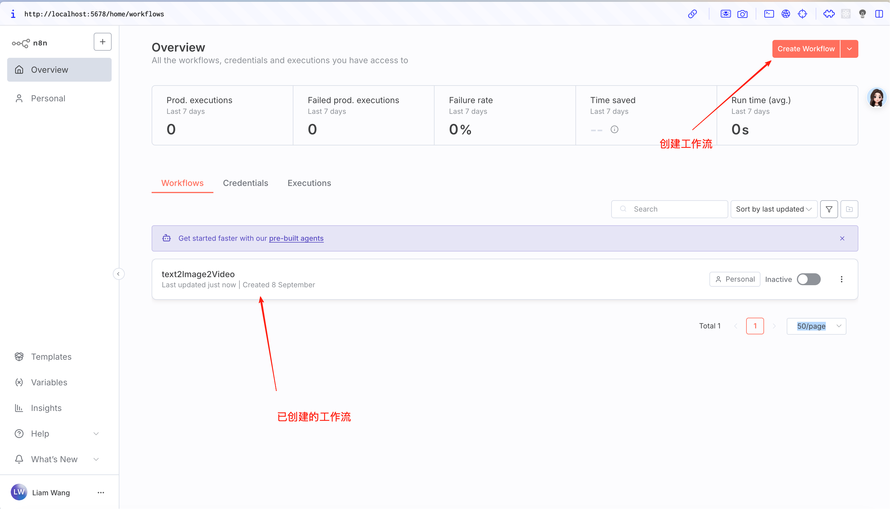
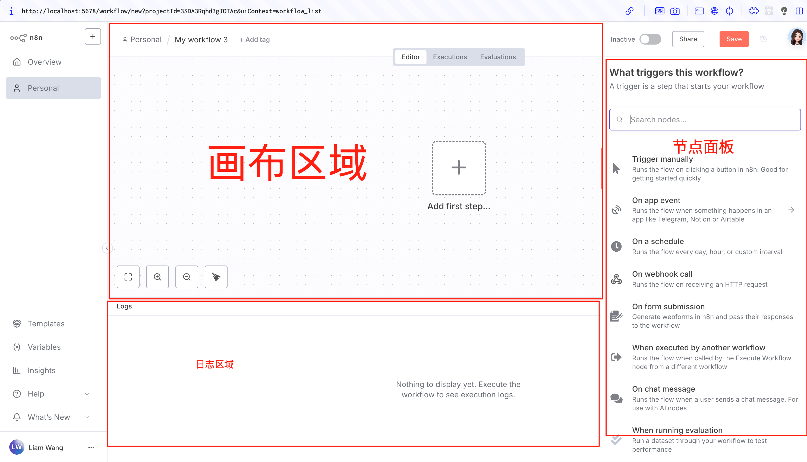
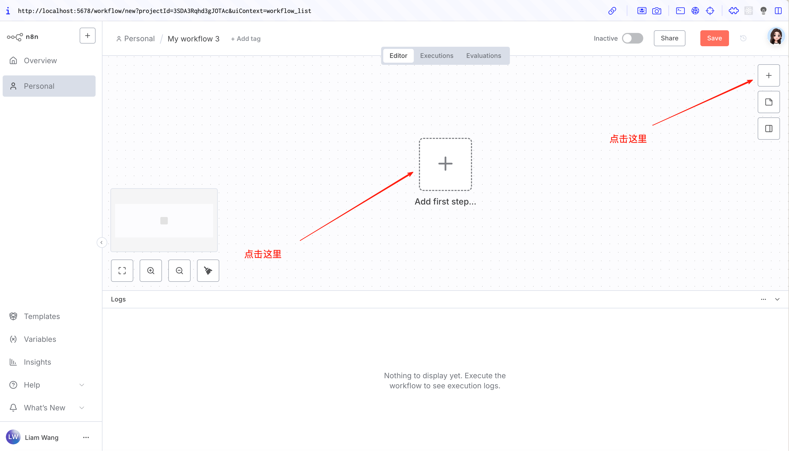

# n8n 入门指南（上）— 你的第一个自动化工作台

## **引言：嘿，你需要一个“数字助理”吗？**

来，先别急着往下划，看看这个场景你熟不熟：

每周一，雷打不动，你都要像个机器人一样，登录好几个系统，导出各种数据，然后小心翼翼地复制、粘贴到 Excel 里。吭哧吭哧弄好半天，汇总分析完，还得截图、写报告，再手动发到工作群和老板邮箱。

是不是感觉一周的精力，刚开始就被这些破事儿给“内耗”掉了？

如果，我说如果，有个全年无休、绝对忠心、还不要工资的“数字助理”能替你搞定这一切，香不香？

这，就是 [n8n](https://n8n.io/) 想帮你解决的问题。简单来说，它就是一个让你像“搭乐高”一样，把各种 App（对，包括你最爱的 AI 工具）串起来干活的可视化神器。有了它，你就能把那些烦人的重复劳动，打包成一个**自动化流程**，然后彻底解放自己，去摸…啊不，去干点更有创造性的事儿。

今天这篇，咱不动手，纯“踩点”。我带你溜达一圈，先熟悉熟悉这位新助理的“办公室”长啥样，认识一下它的基本工具。

***

## **n8n 是个啥？名字咋这么怪？**

在进“办公室”之前，咱先解决一个迷思：”n8n“ 这名儿到底咋来的？

放心，不是乱码。你跟着我念：**n-eight-n**（嗯-诶特-嗯）。

这名字其实是个“程序员式”的缩写。创始人 Jan Oberhauser 最初给它起名叫 “**nodemation**”，这个词由两部分组成：

* **node**：既代表了 n8n 可视化的“节点”视图，也代表了它的技术基石 Node.js。
* **mation**：取自 “automation”（自动化），点明了它的核心使命。

但问题来了，“nodemation”这名字也太长了！每次在命令行里敲这么一长串，手都得抽筋。于是，创始人灵机一动，取了首字母 `n` 和尾字母 `n`，中间夹着 8 个字母，于是就有了现在这个酷酷的 “n8n”。

就像创始人自己说的：

> 一句话解释： 它的意思是 "nodemation"，读作 n-eight-n。

> 长话短说版： “我发现所有我能想到的好名字和域名都被占了，最后选了 nodemation...但它实在太长了，我无法想象每次都在命令行里敲它。最后，就变成了'n8n'。” - Jan Oberhauser, n8n.io 创始人兼 CEO

***

## **n8n 界面导览：来，认识你的工作台**

好了，身世之谜解开了，咱正式“潜入” n8n 的内部看看。

当你第一次登录进来，会看到一个类似这样的仪表盘，展示了你所有的工作流。

但真正的魔法，发生在你点击“Create workflow”或进入一个已有的工作流之后。走，进去瞧瞧！

***

进来之后，就是这个主战场了。别看它空荡荡的，这里就是你未来施展自动化魔法的舞台。我们可以把它拆成三大核心区域，我一个个给你讲明白。

### **区域一：工作流画布 (Workflow Canvas) — 你的创意画板**

这块占据屏幕中央的区域，就是你的“画板”。你所有的自动化点子、所有的流程逻辑，都将在这里，通过拖拽和连接不同的“工具”（也就是我们马上要说的“节点”），变成一幅清晰可见的蓝图。**简单说，这儿就是你把想法变成现实的地方。**

### **区域二：节点面板 (Nodes Panel) — 你的“乐高”零件库**

看到画布右边的 `+` 号了吗？点一下，就会弹出你的“零件库”。

这里就像一个巨大的工具箱，装满了成百上千种“节点”。小到发邮件、读表格，大到连接数据库、操作飞书/钉钉，再到调用 OpenAI、Google Gemini 这类酷炫的 AI 模型，你需要的几乎所有工具，都能在这里找到。

这些工具（节点）有简单的“扳手”（比如 `Set` 节点），也有复杂的“瑞士军刀”（比如 `AI Agent` 节点）。需要啥，直接在上面搜索，然后拖到你的画板上就行，方便得很！

> 如果看不到节点面板，则点画布的右边的 + 按钮，即可打卡

### **区域三：执行日志 (Executions Log) — 你的“飞行记录仪”**

界面底部这个区域，是你数字助理的“工作日志”，或者叫“飞行记录仪”。

你创建的自动化流程，每一次运行，是成功起飞还是中途“坠机”，这里都记录得一清二楚。如果哪个环节出了 Bug，它会立刻“报警”，告诉你具体是哪一步、因为什么原因失败了。这里是你排查问题、优化流程的“侦探笔记”，绝对是你最可靠的后盾。

## **核心概念解析：n8n 的“黑话”**

好，办公室逛完了，工具也认全了。现在，我们来学几句 n8n 世界里的“黑话”，或者叫通用语。掌握了它们，你才算真正入门。

别怕，不难。咱们用做一道“番茄炒蛋”来打比方，包你一学就会。

***

### **工作流 (Workflow) — 一份完整的“菜谱”**

* **类比：** 一份完整的“番茄炒蛋菜谱”，上面写明了从备料到出锅的所有步骤和顺序。
* **在 n8n 里：** 一个 **工作流 (Workflow)**，就是你设计的**一整套自动化任务**。比如，“每天早上9点，自动看天气预报，如果下雨就发消息提醒我带伞”——这整个流程，就是一个工作流。你在画板上搭的所有积木（节点和连接），合起来就是它。

### **节点 (Node) — 菜谱里的一个具体步骤**

* **类比：** 菜谱里的一个具体动作，比如“步骤一：打俩鸡蛋”、“步骤二：西红柿切块”、“步骤三：起锅烧油”。
* **在 n8n 里：** 一个 **节点 (Node)**，就是流程中的**一个具体操作**。它可以是“读取一个文件”、“调用 AI 总结一段话”，或者“发一条钉钉消息”。你从零件库里拖到画板上的每一个模块，都是一个节点。

### **连接 (Connection) — 连接步骤的箭头，也是数据的“管道”**

* **类比：** 菜谱上，从“打鸡蛋”指向“下锅炒”的那个箭头。它规定了做事的先后顺序。
* **在 n8n 里：** 一条 **连接 (Connection)** 就是节点之间那根线。但它**不只是代表顺序**，更关键的是，它还是一根**数据的“传输管道”**！上一个节点处理完的结果（数据），会顺着这根线，流到下一个节点，成为下一步操作的原料。这是让整个流程“活”起来的关键。

### **触发器 (Trigger) — 那声“开饭啦！”**

* **类比：** 开始做这道菜的“信号”。这个信号可以是，你自己喊一嗓子“开饭！”（**手动触发**）；也可以是，墙上的时钟指向了晚上6点（**定时触发**）；还可以是，家人群里发来一条消息说“我饿了”（**Webhook 触发**）。
* **在 n8n 里：触发器 (Trigger)** 是一种很特殊的节点，它必须是整个工作流的“龙头老大”，负责打响“第一枪”。n8n 提供了各种各样的触发器，最常用的有：
  * **Schedule (定时触发):** 像闹钟一样，每小时、每天、每周，准时开工。
  * **Webhook (网络钩子触发):** 当其他 App（比如有人给你填了份调查问卷）里发生了某件事，那个 App 就会给 n8n 递个“小纸条”，n8n 收到后立刻开始干活。
  * **Manual (手动触发):** 就是那个“Play”按钮，点一下，跑一次。测试流程的时候最常用。

## **总结与课后作业**

恭喜！到这里，你的 n8n“岗前培训”就算圆满结束了。

现在，你应该已经熟悉了 n8n 的工作环境，也掌握了工作流、节点这些“黑话”的意思。理论知识已经拉满，就差上手实操了！

### **你的第一个小任务**

别急着关页面，给你留个“课后作业”：

* 点开 n8n 的[官方模板市场](https://n8n.io/workflows/)，就像逛应用商店一样，去看看全世界的大神们都用 n8n 玩出了哪些花。
* 找一个你感兴趣的模板，大胆地把它 `copy` 到你自己的工作区。别怕弄坏，点点看，研究一下它是怎么由一个个节点连接起来，实现那些神奇功能的。

### **下集预告**

在下一篇 **《n8n 入门指南（下）》** 中，我们将彻底告别理论。我会手把手带你，用今天学到的所有知识，从零开始，亲手搭建一个真正有用又好玩的自动化工作流，比如——“自动抓取行业新闻，让 AI 总结成要点，再每天推送到你的邮箱里”。

敬请期待！

